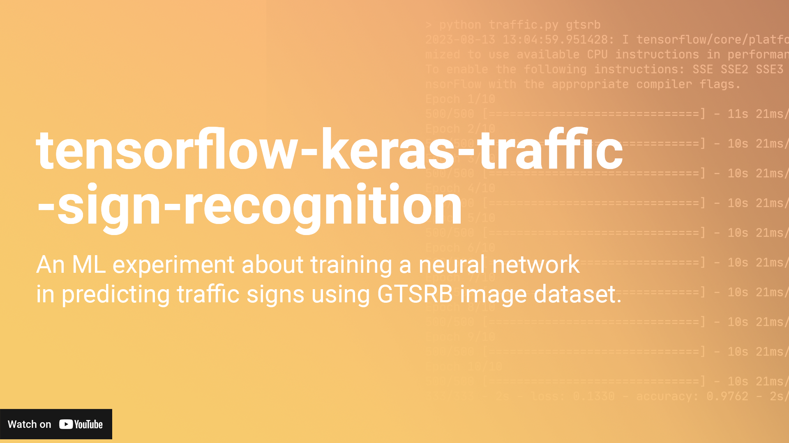

## My CS50AI Tensorflow Experiment

### Table of Contents
- [Overview](#overview)
- [Video Demonstration](#video-demonstration)
- [Table of Contents](#table-of-contents)
- [Preliminaries](#preliminaries)
- [Effects of changing parameters](#effects-of-changing-parameters)
- [Effects of adding copies of identical layers](#effects-of-adding-copies-of-identical-layers)
- [The final model](#the-final-model)
- [Conclusion](#conclusion)

### Overview

In this machine learning experiment, we train a model on an image dataset (provided by CS50AI) called [German Traffic Sign Recognition Benchmark (GTSRB)](http://benchmark.ini.rub.de/?section=gtsrb&subsection=news) using Tensorflow Keras. 

By default, the training is run on the computer CPU, but it is possible to leverage the computing power of any supported Nvidia GPUs with some prerequisites installed: CUDA Runtime and CUDNN. Stable Diffusion, a popular free text-to-image diffusion model which I am well-acquainted with, is known to heavily rely on the GPU to speed up compute times. 

For now, we benchmark the program on the CPU. 

### Video Demonstration
Watch the video demo on YouTube [here](https://youtu.be/ZVDJKppr9TQ).
[](https://youtu.be/ZVDJKppr9TQ)


### Preliminaries

Initially, we make the simplest model possible, i.e. minimal layers:
```python
def get_model():
    model = models.Sequential()
    model.add(Input(shape=input_shape))
    model.add(layers.Conv2D(filters, kernel_size, activation="relu"))
    
    model.add(layers.Flatten())

    # Output layer
    model.add(layers.Dense(NUM_CATEGORIES, activation="softmax"))
```
where
```python
input_shape = (IMG_WIDTH, IMG_HEIGHT, 3)
filters = 32
kernel_size = (3, 3)
```
Here, each epoch runs for 6 seconds on the average. This model yields `loss: 1.236` and `accuracy: 0.9062`. 

Starting here, our goal is to reduce loss and increase accuracy (and ideally, compute times) as much as possible. 

### Effects of changing parameters

We begin by incrementally modifying our base configuration. To start with, setting `filters = 64` results to longer compute time of 11 seconds with no significant improvement. Meanwhile, setting `kernel_size = (4, 4)` decreases accuracy.

If we add a max pooling layer as follows:
```python
def get_model():
    model = models.Sequential()
    model.add(Input(shape=input_shape))
    model.add(layers.Conv2D(filters, kernel_size, activation="relu"))

    # Add max pooling layer
    model.add(k.layers.MaxPooling2D(pool_size=pool_size))
    
    model.add(layers.Flatten())

    # Output layer
    model.add(layers.Dense(NUM_CATEGORIES, activation="softmax"))
```
where
```python
pool_size = (2, 2)
```
we can expect good results (`loss: 0.5857` and `accuracy: 0.9391`) compared to the base model. Better yet, if we set `pool_size = (3, 3)`, we see improvements of `loss: 0.5076` and `accuracy: 0.9415`. Enlarging the pool size further gives no significant improvement. In these two cases, each epoch runs for 4 seconds and 3 seconds, respectively.

If we add a hidden layer as follows:
```python
def get_model():
    model = models.Sequential()
    model.add(Input(shape=input_shape))
    model.add(layers.Conv2D(filters, kernel_size, activation="relu"))

    # Add max pooling layer
    model.add(k.layers.MaxPooling2D(pool_size=pool_size))
    
    model.add(layers.Flatten())

    # Add hidden layer
    model.add(k.layers.Dense(units, activation=activation))

    # Output layer
    model.add(layers.Dense(NUM_CATEGORIES, activation="softmax"))
```
where
```python
units = 128
```
we get good results (`loss: 0.4242` and `accuracy: 0.9363`) with each epoch finishing in 4 seconds. Doubling or halving `units` only gives higher loss and lower accuracy.

Meanwhile, adding a dropout layer with any positive rate value into the model (say, `0.1`) as follows yields noticeably undesirably effects (`loss: 0.6107` and `accuracy: 0.8163`).
```python
model.add(k.layers.Dropout(rate))
```
Similarly, doubling the number of epochs from 10 to 20 only doubles the overall runtime of the program but yields no significant improvement (`loss: 0.4102` and `accuracy: 0.938`).

### Effects of adding copies of identical layers

We now settled on a good configuration out of the layers we've added so far. From this point forward, we now investigate the effects of increasing the number of convolution layers, pooling layers, or hidden layers to loss and accuracy.

If we make two identical copies of the convolution layer as follows:
```python
def get_model():
    model = models.Sequential()
    model.add(Input(shape=input_shape))
    
    # Add two identical convolution layers 
    model.add(layers.Conv2D(filters, kernel_size, activation="relu"))
    model.add(layers.Conv2D(filters, kernel_size, activation="relu"))

    # Add max pooling layer
    model.add(k.layers.MaxPooling2D(pool_size=pool_size))
    
    model.add(layers.Flatten())

    # Add hidden layer
    model.add(k.layers.Dense(units, activation=activation))

    # Output layer
    model.add(layers.Dense(NUM_CATEGORIES, activation="softmax"))
```
we see a massive decrease in loss (`loss: 0.2212` and `accuracy: 0.9578`) in exchange of compute time. In this configuration, each epoch finishes longer for 11 seconds. Further, making three identical copies of the convolution layer decreases loss even further (`loss: 0.1577` and `accuracy: 0.9673`) with each epoch running for 15 seconds. Similar effects can be observed if we make two identical copies of hidden layer (`loss: 0.3389` and `accuracy: 0.9337`) while maintaining 5 seconds finishing time for each epoch. Anything higher than two hidden layers show no significant changes to results.

Meanwhile, adding additional copies of pooling layers slightly increases loss and decreases accuracy. Here, each epoch runs for 9 seconds. This is likely due to the fact that pooling layers down-samples the image, making the resolution lower. Hence we keep only one pooling layer while maintaining two identical copies of convolution layer.

### The final model

The best record has been observed in the configuration with two copies for each of convolution layer and hidden layer, shown as follows:
```python
def get_model():
    model = models.Sequential()
    model.add(Input(shape=input_shape))
    
    # Add two identical convolution layers 
    model.add(layers.Conv2D(filters, kernel_size, activation="relu"))
    model.add(layers.Conv2D(filters, kernel_size, activation="relu"))

    # Add max pooling layer
    model.add(k.layers.MaxPooling2D(pool_size=pool_size))
    
    model.add(layers.Flatten())

    # Add two identical hidden layers
    model.add(k.layers.Dense(units, activation=activation))
    model.add(k.layers.Dense(units, activation=activation))

    # Output layer
    model.add(layers.Dense(NUM_CATEGORIES, activation="softmax"))
```
This configuration yields `loss: 0.1345` and `accuracy: 0.9767`. Here, each epoch finishes in 13 seconds. This may be improved if we run the program on the GPU.

### Conclusion

There is a trade-off between accuracy, loss, and compute times. The more we pursue better accuracy and loss, the complexity of computations will increase. If access to good hardware is not an issue, one could make use of Nvidia GPUs. Consumer-grade GPUs nowadays are capable of training models suitable for Stable Diffusion in an hour. Anything simpler than that such as this traffic sign recognition project is highly feasible.
